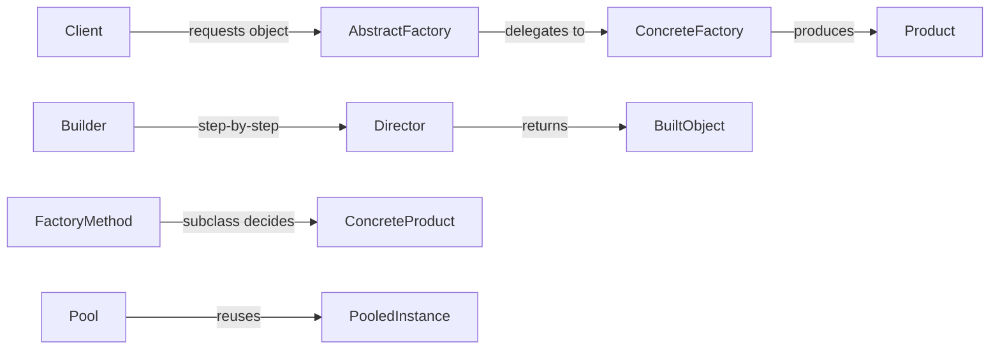
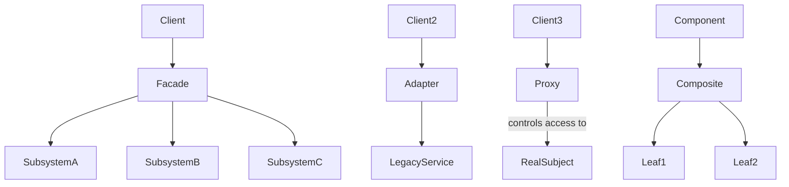
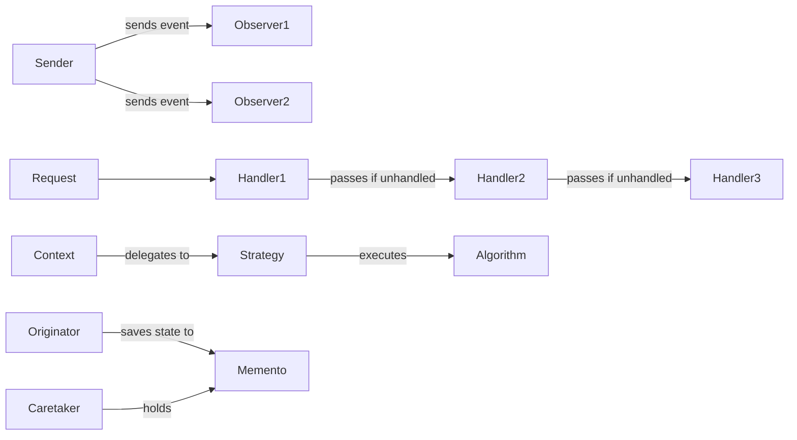

# README.md — вставки с диаграммами Mermaid

> Ниже показаны **три блока**, которые нужно вставить в `README.md` перед таблицей каждого раздела.
> Каждый блок отделён от окружающего текста пустой строкой (требование GitHub Markdown renderer).

---

## 🔵 Вставка 1 — перед таблицей **Creational Patterns**

Место: сразу после строки `## Creational Patterns` и перед строкой `| Pattern | Description |`

```markdown
## Creational Patterns

> Patterns that deal with **object creation** — abstracting and controlling how instances are made.



| Pattern | Description |
```

---

## 🟢 Вставка 2 — перед таблицей **Structural Patterns**

Место: сразу после строки `## Structural Patterns` и перед строкой `| Pattern | Description |`

```markdown
## Structural Patterns

> Patterns that define **how classes and objects are composed** to form larger, flexible structures.



| Pattern | Description |
```

---

## 🟠 Вставка 3 — перед таблицей **Behavioral Patterns**

Место: сразу после строки `## Behavioral Patterns` и перед строкой `| Pattern | Description |`

```markdown
## Behavioral Patterns

> Patterns concerned with **communication and responsibility** between objects.



| Pattern | Description |
```

---

> **Примечание для ревьюеров:** диаграммы намеренно упрощены — цель показать *ключевое взаимодействие* каждой группы, а не полную UML-схему каждого паттерна. Детали реализации — в `.py`-файлах.

