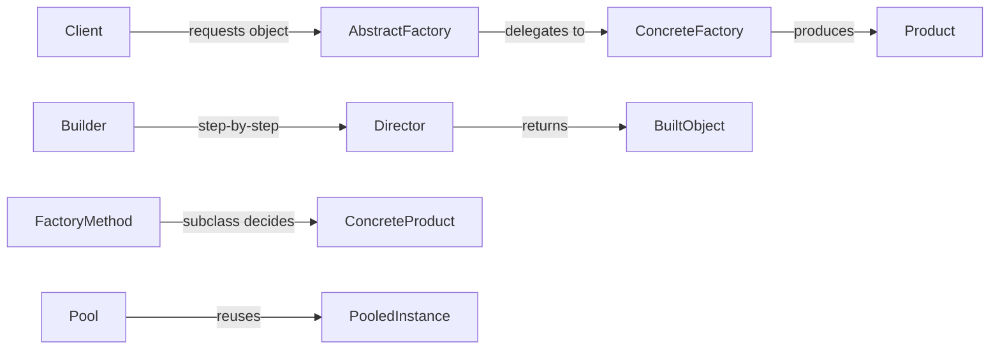
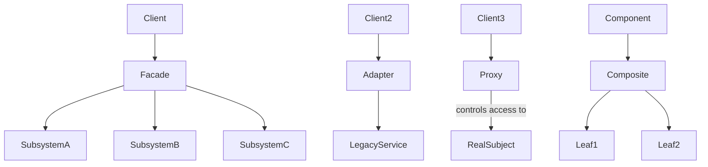
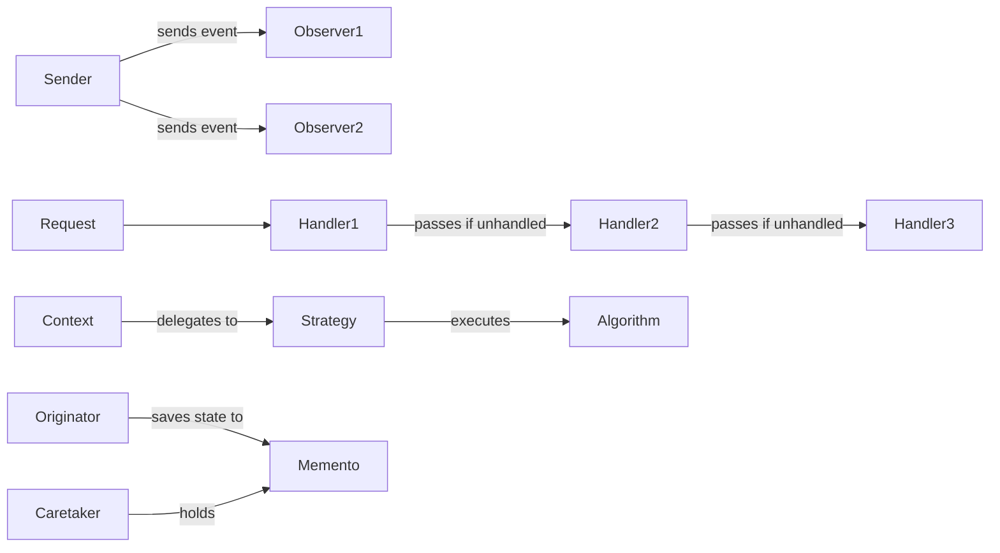

# python-patterns

A collection of design patterns and idioms in Python.

## Creational Patterns

> Patterns that deal with **object creation** — abstracting and controlling how instances are made.

| Pattern | Description |
|:------- |:----------- |
| [abstract_factory](patterns/creational/abstract_factory.py) | use a generic interface to create a family of related objects |
| [borg](patterns/creational/borg.py) | a singleton with shared-state among instances |
| [builder](patterns/creational/builder.py) | instead of using complex constructors, isolate the construction of an object and make it multi-step |
| [factory](patterns/creational/factory.py) | delegate the creation of objects to specialized methods or classes |
| [lazy_evaluation](patterns/creational/lazy_evaluation.py) | wait until the value is needed to calculate it |
| [pool](patterns/creational/pool.py) | preinstantiate and maintain a group of objects of the same type |
| [prototype](patterns/creational/prototype.py) | use a factory to create new objects by copying an existing instance |
| [singleton](patterns/creational/singleton.py) | restrict the instantiation of a class to one object |

## Structural Patterns

> Patterns that define **how classes and objects are composed** to form larger, flexible structures.

| Pattern | Description |
|:------- |:----------- |
| [3-tier](patterns/structural/3-tier.py) | data<->business logic<->presentation separation (strict relationships) |
| [adapter](patterns/structural/adapter.py) | adapt one interface to another using a white-box wrapper |
| [bridge](patterns/structural/bridge.py) | decouple an abstraction from its implementation |
| [composite](patterns/structural/composite.py) | encapsulate a group of objects into a single object |
| [decorator](patterns/structural/decorator.py) | wrap a class to add new functionality without changing its structure |
| [facade](patterns/structural/facade.py) | provide a simplified interface to a complex system |
| [flyweight](patterns/structural/flyweight.py) | use sharing to support a large number of objects efficiently |
| [front_controller](patterns/structural/front_controller.py) | a single entry point for all requests to an application |
| [proxy](patterns/structural/proxy.py) | an object representing another object |
| [mvc](patterns/structural/mvc.py) | separate data (model), user interface (view), and logic (controller) |

## Behavioral Patterns

> Patterns concerned with **communication and responsibility** between objects.

| Pattern | Description |
|:------- |:----------- |
| [chain_of_responsibility](patterns/behavioral/chain_of_responsibility.py) | allow multiple objects to handle a request without them needing to know about each other |
| [command](patterns/behavioral/command.py) | encapsulate a request as an object, allowing for parameterization and queuing |
| [catalog](patterns/behavioral/catalog.py) | a class that allows looking up other classes based on various criteria |
| [chaining_method](patterns/behavioral/chaining_method.py) | allow calling multiple methods on the same object in a single statement |
| [interpreter](patterns/behavioral/interpreter.py) | define a grammar for a language and use it to interpret statements |
| [iterator](patterns/behavioral/iterator.py) | provide a way to access elements of a collection sequentially |
| [mediator](patterns/behavioral/mediator.py) | encapsulate how a set of objects interact |
| [memento](patterns/behavioral/memento.py) | capture and restore an object's internal state |
| [observer](patterns/behavioral/observer.py) | allow objects to notify other objects about changes in their state |
| [publish_subscribe](patterns/behavioral/publish_subscribe.py) | allow objects to subscribe to events and receive notifications when they occur |
| [registry](patterns/behavioral/registry.py) | keep track of all instances of a class |
| [specification](patterns/behavioral/specification.py) | define a set of criteria that an object must meet |
| [state](patterns/behavioral/state.py) | allow an object to change its behavior when its internal state changes |
| [strategy](patterns/behavioral/strategy.py) | define a family of algorithms and make them interchangeable |
| [template](patterns/behavioral/template.py) | define the skeleton of an algorithm in a method, allowing subclasses to override specific steps |
| [visitor](patterns/behavioral/visitor.py) | separate an algorithm from the object structure it operates on |
